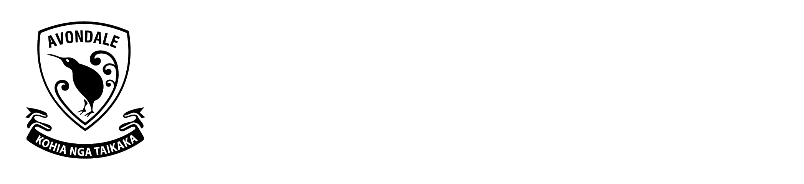

# 
# Avcol Co-Curricular Website
Easily create, edit, delete, filter Avondale College co-curricular activities available to students, view activities in a timetable, find which room they are held in, when they start and finish, and how to contact the relevant teacher in charge of an activity.

## Getting Started

### Prerequisites
- [.NET 6.0](https://dotnet.microsoft.com/download/dotnet/6.0)

### Installation
1. Download and open the project.
2. Run the project on Release.

#### Git Commands
1. ```git clone https://github.com/LucasMcKinney/AvcolCoCurricularWebsite.git```
2. ```cd AvcolCoCurricularWebsite\AvcolCoCurricularWebsite```
3. ```dotnet run```
